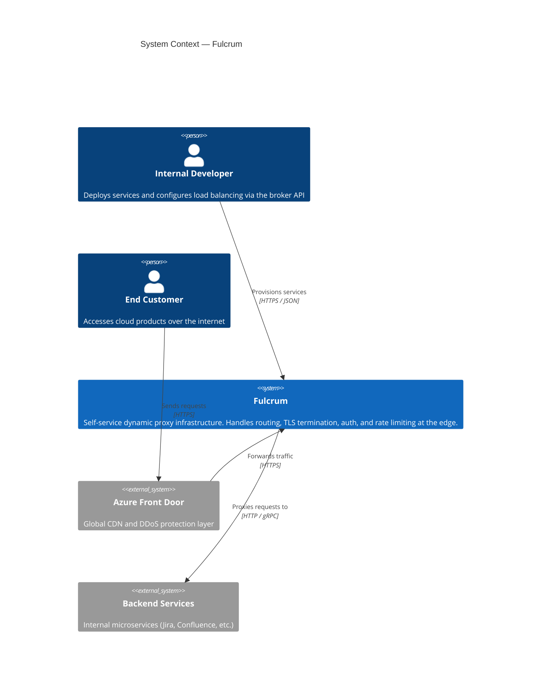
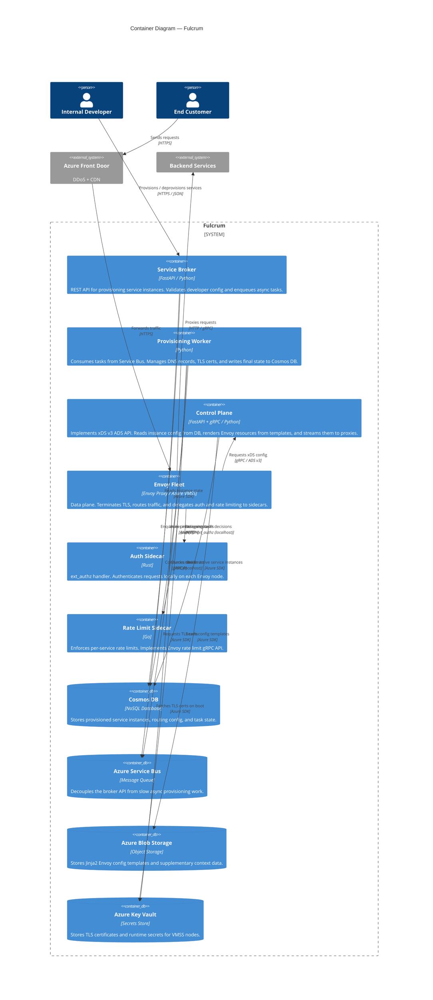
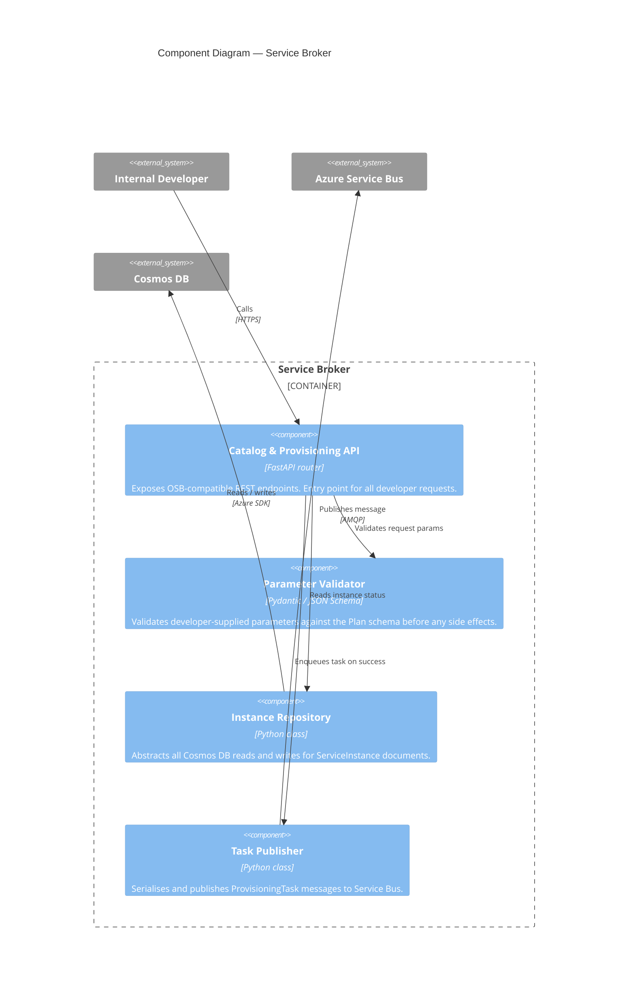

# Fulcrum — C4 Architecture

## Level 1: System Context

```mermaid
C4Context
    title System Context — Fulcrum

    Person(dev, "Internal Developer", "Deploys services and configures load balancing via the broker API")
    Person(customer, "End Customer", "Accesses cloud products over the internet")

    System(elb, "Fulcrum", "Self-service dynamic proxy infrastructure. Handles routing, TLS termination, auth, and rate limiting at the edge.")

    System_Ext(frontdoor, "Azure Front Door", "Global CDN and DDoS protection layer")
    System_Ext(backend, "Backend Services", "Internal microservices (Jira, Confluence, etc.)")

    Rel(dev, elb, "Provisions services", "HTTPS / JSON")
    Rel(customer, frontdoor, "Sends requests", "HTTPS")
    Rel(frontdoor, elb, "Forwards traffic", "HTTPS")
    Rel(elb, backend, "Proxies requests to", "HTTP / gRPC")
```

---

## Level 2: Container Diagram

```mermaid
C4Container
    title Container Diagram — Fulcrum

    Person(dev, "Internal Developer")
    Person(customer, "End Customer")

    System_Ext(frontdoor, "Azure Front Door", "DDoS + CDN")
    System_Ext(backend, "Backend Services")

    System_Boundary(elb, "Fulcrum") {
        Container(broker, "Service Broker", "FastAPI / Python", "REST API for provisioning service instances. Validates developer config and enqueues async tasks.")
        Container(worker, "Provisioning Worker", "Python", "Consumes tasks from Service Bus. Manages DNS records, TLS certs, and writes final state to Cosmos DB.")
        Container(cp, "Control Plane", "FastAPI + gRPC / Python", "Implements xDS v3 ADS API. Reads instance config from DB, renders Envoy resources from templates, and streams them to proxies.")
        Container(envoy, "Envoy Fleet", "Envoy Proxy / Azure VMSS", "Data plane. Terminates TLS, routes traffic, and delegates auth and rate limiting to sidecars.")
        Container(auth_sidecar, "Auth Sidecar", "Rust", "ext_authz handler. Authenticates requests locally on each Envoy node.")
        Container(ratelimit_sidecar, "Rate Limit Sidecar", "Go", "Enforces per-service rate limits. Implements Envoy rate limit gRPC API.")

        ContainerDb(cosmosdb, "Cosmos DB", "NoSQL Database", "Stores provisioned service instances, routing config, and task state.")
        ContainerDb(servicebus, "Azure Service Bus", "Message Queue", "Decouples the broker API from slow async provisioning work.")
        ContainerDb(blobstorage, "Azure Blob Storage", "Object Storage", "Stores Jinja2 Envoy config templates and supplementary context data.")
        ContainerDb(keyvault, "Azure Key Vault", "Secrets Store", "Stores TLS certificates and runtime secrets for VMSS nodes.")
    }

    Rel(dev, broker, "Provisions / deprovisions services", "HTTPS / JSON")
    Rel(broker, servicebus, "Enqueues provisioning tasks", "AMQP")
    Rel(broker, cosmosdb, "Reads instance state", "Azure SDK")
    Rel(worker, servicebus, "Consumes tasks", "AMQP")
    Rel(worker, cosmosdb, "Writes instance state", "Azure SDK")
    Rel(worker, keyvault, "Requests TLS certs", "Azure SDK")
    Rel(cp, cosmosdb, "Reads active service instances", "Azure SDK")
    Rel(cp, blobstorage, "Reads config templates", "Azure SDK")
    Rel(envoy, cp, "Requests xDS config", "gRPC / ADS v3")
    Rel(envoy, auth_sidecar, "Delegates auth decisions", "HTTP ext_authz (localhost)")
    Rel(envoy, ratelimit_sidecar, "Checks rate limits", "gRPC (localhost)")
    Rel(envoy, keyvault, "Fetches TLS certs on boot", "Azure SDK")
    Rel(customer, frontdoor, "Sends requests", "HTTPS")
    Rel(frontdoor, envoy, "Forwards traffic", "HTTPS")
    Rel(envoy, backend, "Proxies requests", "HTTP / gRPC")
```

---

## Level 3: Component Diagram — Service Broker

```mermaid
C4Component
    title Component Diagram — Service Broker

    System_Ext(dev, "Internal Developer")
    System_Ext(servicebus, "Azure Service Bus")
    System_Ext(cosmosdb, "Cosmos DB")

    Container_Boundary(broker, "Service Broker") {
        Component(api, "Catalog & Provisioning API", "FastAPI router", "Exposes OSB-compatible REST endpoints. Entry point for all developer requests.")
        Component(validator, "Parameter Validator", "Pydantic / JSON Schema", "Validates developer-supplied parameters against the Plan schema before any side effects.")
        Component(repo, "Instance Repository", "Python class", "Abstracts all Cosmos DB reads and writes for ServiceInstance documents.")
        Component(publisher, "Task Publisher", "Python class", "Serialises and publishes ProvisioningTask messages to Service Bus.")
    }

    Rel(dev, api, "Calls", "HTTPS")
    Rel(api, validator, "Validates request params")
    Rel(api, repo, "Reads instance status")
    Rel(api, publisher, "Enqueues task on success")
    Rel(repo, cosmosdb, "Reads / writes", "Azure SDK")
    Rel(publisher, servicebus, "Publishes message", "AMQP")
```
