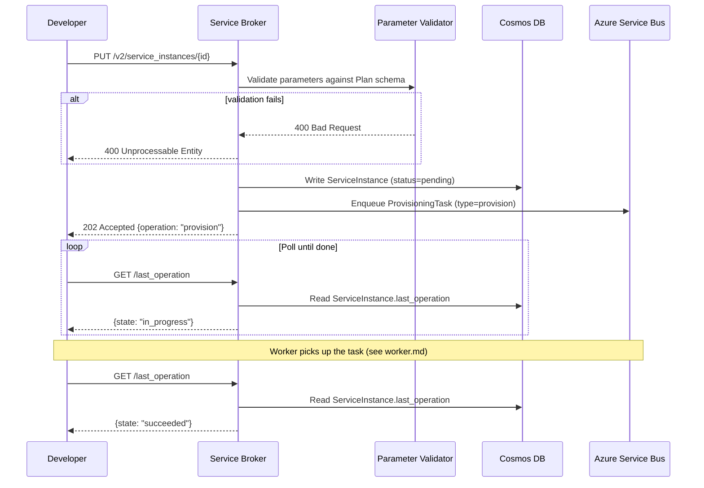
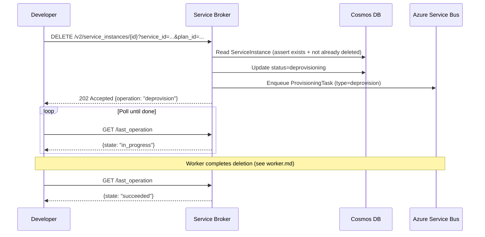

# Service Broker

## Purpose

Exposes a REST API (Open Service Broker spec) for internal developers to provision, update, and deprovision load balancing resources. Provisioning is asynchronous — the API queues a task to Azure Service Bus and returns 202 immediately. Developers poll `/last_operation` to track progress.

---

## Data Models

### ServiceInstance
```
id:               UUID           # stable identifier for the provisioned resource
service_id:       string         # which service from the catalog
plan_id:          string         # which plan (determines capabilities + schema)
organization_id:  string         # owning org
space_id:         string         # owning space / team
parameters:       JSON           # developer-supplied config (validated against Plan schema)
status:           enum           # pending | provisioning | ready | failed | deprovisioning | deleted
created_at:       datetime
updated_at:       datetime
last_operation:   LastOperation
```

### LastOperation
```
type:         enum        # provision | deprovision | update
state:        enum        # in_progress | succeeded | failed
description:  string
updated_at:   datetime
```

### Service  *(catalog entry)*
```
id:           UUID
name:         string
description:  string
bindable:     bool
plans:        List[Plan]
```

### Plan
```
id:           UUID
service_id:   UUID
name:         string
description:  string
schemas:      JSON     # JSON Schema for parameter validation (request + response)
```

### ProvisioningTask  *(enqueued to Service Bus)*
```
task_id:      UUID
instance_id:  UUID
task_type:    enum        # provision | deprovision | update
payload:      JSON        # full ServiceInstance parameters
attempt:      int
enqueued_at:  datetime
```

---

## API

### GET /v2/catalog
Returns all services and plans available for provisioning.

**Response 200**
```json
{
  "services": [
    {
      "id": "f8ccf060-...",
      "name": "load-balancer",
      "description": "Self-service edge load balancing via Envoy",
      "bindable": false,
      "plans": [
        {
          "id": "a1b2c3d4-...",
          "name": "standard",
          "description": "Single-region, TLS termination, basic routing"
        }
      ]
    }
  ]
}
```

---

### PUT /v2/service_instances/{instance_id}
Provision a new service instance. Idempotent on the same `instance_id`.

**Request body**
```json
{
  "service_id": "f8ccf060-...",
  "plan_id": "a1b2c3d4-...",
  "organization_id": "org-001",
  "space_id": "space-001",
  "parameters": {
    "domains": ["myapp.example.com"],
    "upstream_host": "myapp-backend.internal",
    "upstream_port": 8080,
    "tls": true,
    "timeout_seconds": 30
  }
}
```

**Response 202** *(accepted, async)*
```json
{ "operation": "provision" }
```

**Response 200** *(already exists, identical params)*
```json
{}
```

**Response 409** *(already exists, different params)*

---

### PATCH /v2/service_instances/{instance_id}
Update parameters of an existing instance (e.g. add a domain, change upstream).

**Request body**
```json
{
  "parameters": {
    "domains": ["myapp.example.com", "myapp-v2.example.com"]
  }
}
```

**Response 202**
```json
{ "operation": "update" }
```

---

### DELETE /v2/service_instances/{instance_id}
Deprovision an instance.

**Query params:** `service_id`, `plan_id`

**Response 202**
```json
{ "operation": "deprovision" }
```

**Response 410** *(already deleted)*

---

### GET /v2/service_instances/{instance_id}/last_operation
Poll the status of the most recent async operation.

**Query params:** `operation` (optional, from the 202 response)

**Response 200**
```json
{
  "state": "in_progress",
  "description": "Creating DNS records"
}
```
```json
{
  "state": "succeeded",
  "description": "Instance ready"
}
```
```json
{
  "state": "failed",
  "description": "DNS record creation failed: zone not found"
}
```

---

## Flow

### Provisioning Flow



### Deprovision Flow


