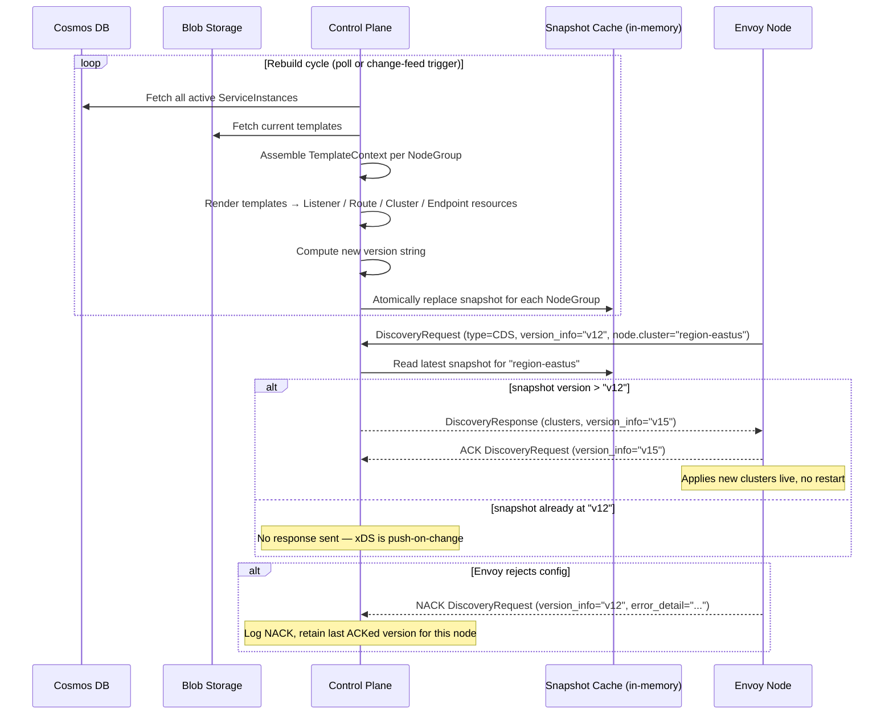
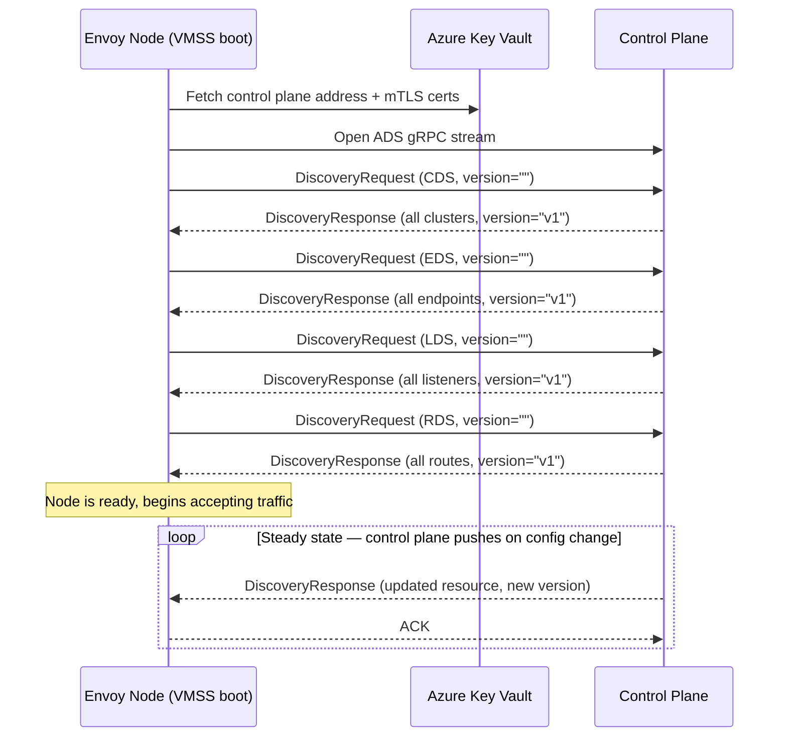

# Control Plane (xDS Server)

## Purpose

Implements the Envoy xDS v3 Aggregated Discovery Service (ADS) over gRPC. Reads active `ServiceInstance` records from Cosmos DB and Jinja2 templates from Blob Storage, renders them into Envoy-native resources, caches them as versioned snapshots, and streams updates to Envoy nodes in real time.

---

## Data Models

### Snapshot
A versioned, immutable set of Envoy resources for a logical node group.

```
node_group:   string              # logical group of Envoy nodes (e.g. "region-eastus")
version:      string              # monotonically increasing string (e.g. unix timestamp)
listeners:    List[Listener]      # rendered protobuf resources
routes:       List[RouteConfig]
clusters:     List[Cluster]
endpoints:    List[ClusterLoadAssignment]
updated_at:   datetime
```

### NodeGroup
Logical grouping of Envoy instances. Determines which `ServiceInstances` are in scope for a given set of proxies.

```
id:       string    # matches Envoy bootstrap node.cluster value
region:   string
```

### Template  *(stored in Blob Storage)*
```
name:           string
resource_type:  enum    # listener | route | cluster | endpoint
blob_path:      string
content:        string  # Jinja2 template, emits JSON Envoy protobuf
```

### TemplateContext  *(assembled per render cycle)*
```
instances:    List[ServiceInstance]   # active instances from Cosmos DB
node_group:   NodeGroup
metadata:     JSON                    # supplementary data from Blob Storage
```

---

## Rendered Envoy Resource Types

### Listener
```
name:           string
address:
  socket_address:
    address:    "0.0.0.0"
    port_value: 443
filter_chains:
  - filters:
      - name: "envoy.filters.network.http_connection_manager"
        typed_config:
          route_config_name: string
          access_log:         [...]
          http_filters:
            - envoy.filters.http.ext_authz
            - envoy.filters.http.ratelimit
            - envoy.filters.http.router
```

### RouteConfiguration
```
name:           string
virtual_hosts:
  - name:     string
    domains:  List[string]       # from ServiceInstance.parameters.domains
    routes:
      - match:
          prefix: "/"
        route:
          cluster: string        # references a Cluster by name
          timeout: duration
          retry_policy: {...}
```

### Cluster
```
name:             string          # unique per ServiceInstance upstream
type:             STRICT_DNS
lb_policy:        ROUND_ROBIN
load_assignment:
  cluster_name: string
  endpoints:
    - lb_endpoints:
        - endpoint:
            address:
              socket_address:
                address:    string    # upstream_host from parameters
                port_value: int       # upstream_port from parameters
health_checks:    [...]
transport_socket:                     # TLS to upstream if configured
  name: envoy.transport_sockets.tls
```

---

## API

### gRPC — xDS v3 ADS

**Service:** `envoy.service.discovery.v3.AggregatedDiscoveryService`
**Method:** `StreamAggregatedResources` (bidirectional stream)

Each Envoy node opens one persistent stream. It sends `DiscoveryRequest` messages for each resource type it wants. The control plane responds with `DiscoveryResponse` messages containing the current resources and a version string. The node ACKs or NACKs with the version token.

**Supported type URLs:**
| Short name | Proto type URL |
|---|---|
| LDS | `type.googleapis.com/envoy.config.listener.v3.Listener` |
| RDS | `type.googleapis.com/envoy.config.route.v3.RouteConfiguration` |
| CDS | `type.googleapis.com/envoy.config.cluster.v3.Cluster` |
| EDS | `type.googleapis.com/envoy.config.endpoint.v3.ClusterLoadAssignment` |

### REST — Internal / Ops

| Method | Path | Description |
|---|---|---|
| GET | /healthz | Liveness probe |
| GET | /readyz | Readiness probe (cache populated) |
| GET | /snapshots | List current snapshot versions per node group |
| POST | /snapshots/invalidate | Force immediate snapshot rebuild |
| GET | /snapshots/{node_group}/diff | Show diff between current and previous snapshot (debug) |

---

## Flow

### Snapshot Build and Push



### Envoy Node Bootstrap and Steady State


