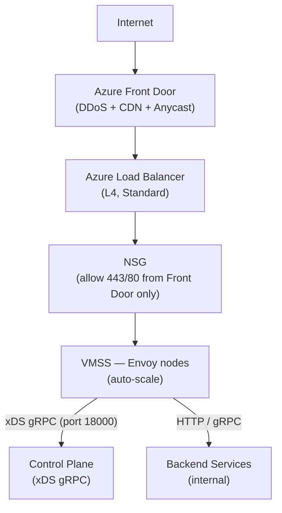
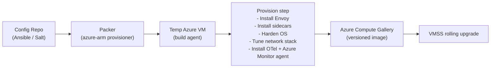
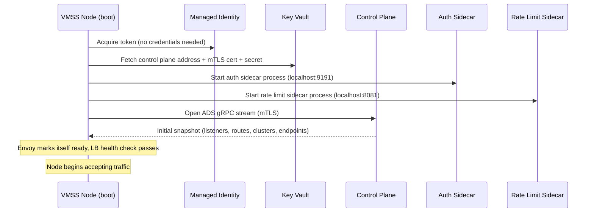
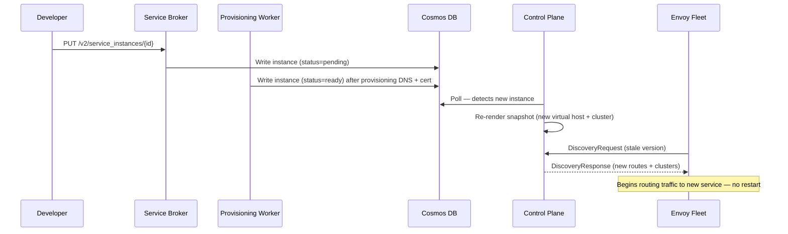

# Envoy Fleet

## Purpose

The data plane. A fleet of Envoy proxy instances running on Azure VM Scale Sets (VMSS) across multiple regions. Handles TLS termination, request routing, and delegates authentication and rate limiting to local sidecar processes. Receives all routing configuration dynamically from the control plane via the xDS ADS API — no proxy restarts required for config changes.

---

## Azure Infrastructure

### Resources Per Region

| Resource | Azure Type | Purpose |
|---|---|---|
| Virtual Network | VNet | Isolated network per region |
| Proxy Subnet | Subnet | Envoy VMSS placement |
| Network Security Group | NSG | Ingress 443/80 from Front Door only. Egress to upstreams. |
| VM Scale Set | VMSS | Auto-scales Envoy node count on CPU / connection metrics |
| Azure Load Balancer | Standard LB (L4) | Distributes inbound connections across VMSS instances |
| Azure Front Door | Global | DDoS protection, CDN, anycast ingress before the LB |
| Azure Compute Gallery | Image gallery | Stores versioned custom Envoy VM images |
| Managed Identity | MSI | Grants VMSS nodes access to Key Vault and Cosmos DB without credentials |
| Azure DNS Zone | Public DNS | Customer-facing domains (updated by the worker) |
| Azure Key Vault | KV | TLS certificates and secrets fetched at node boot |

### Network Topology



---

## VM Image Build Pipeline

Custom images are built with Packer and published to Azure Compute Gallery. VMSS references a specific image version. Rolling image updates trigger a VMSS rolling upgrade.



### Image Contents

| Component | Purpose |
|---|---|
| Envoy proxy binary | Data plane — handles all inbound traffic |
| Auth sidecar (Rust) | ext_authz over localhost — authenticates requests |
| Rate limit sidecar (Go) | Implements Envoy rate limit gRPC API over localhost |
| Azure Monitor agent | Ships metrics and logs to Azure Monitor / Log Analytics |
| OpenTelemetry collector | Distributed tracing (forwards to Azure Application Insights or Jaeger) |
| OS hardening | CIS benchmark, disabled unused services, minimal packages |
| Network tuning | TCP buffer sizes, `somaxconn`, `net.core.rmem_max`, connection tracking limits |

---

## Node Bootstrap Sequence

When a VMSS instance starts:



---

## Sidecar Model

Sidecars run as separate processes on each node (not containers). Envoy communicates with them over localhost only.

```
┌─────────────────────────────────────────────────────┐
│  Envoy node                                         │
│                                                     │
│  ┌─────────────────┐     ext_authz HTTP             │
│  │  HTTP filter    │──── localhost:9191 ────►  Auth Sidecar (Rust)
│  │  ext_authz      │                               │
│  └─────────────────┘                               │
│                                                     │
│  ┌─────────────────┐     ratelimit gRPC             │
│  │  HTTP filter    │──── localhost:8081 ────► Rate Limit Sidecar (Go)
│  │  ratelimit      │                               │
│  └─────────────────┘                               │
└─────────────────────────────────────────────────────┘
```

### Auth Sidecar

- Protocol: `envoy.service.auth.v3.Authorization` (HTTP ext_authz)
- Receives a `CheckRequest` with full request headers.
- Returns `CheckResponse`: allowed or denied with status code and headers to inject.
- Connects to the control plane on startup to receive dynamic auth policy configuration.

### Rate Limit Sidecar

- Protocol: `envoy.service.ratelimit.v3.RateLimitService` (gRPC)
- Receives rate limit descriptors from Envoy (e.g. service ID, client IP).
- Returns `OVER_LIMIT` or `OK`.
- Per-service limits are configured dynamically via the control plane.

---

## Configuration Flow Summary


