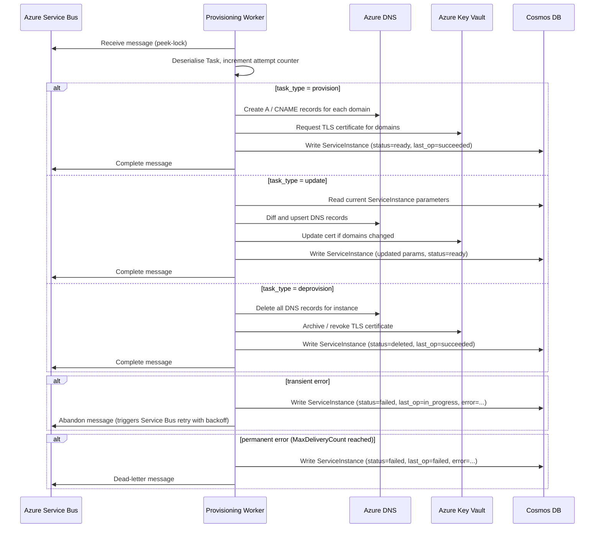
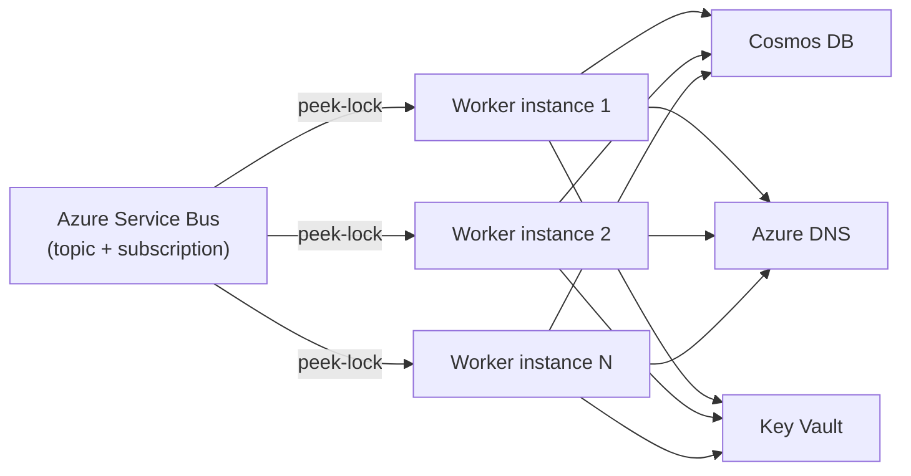

# Provisioning Worker

## Purpose

Consumes `ProvisioningTask` messages from Azure Service Bus and executes side effects: Azure DNS record management, TLS certificate provisioning via Azure Key Vault, and final state writes to Cosmos DB. Decoupled from the broker so that slow or failing provisioning operations do not affect API responsiveness.

---

## Data Models

### Task  *(deserialised from Service Bus message body)*
```
task_id:      UUID
instance_id:  UUID
task_type:    enum        # provision | deprovision | update
payload:      JSON        # full ServiceInstance.parameters snapshot at enqueue time
attempt:      int         # incremented on retry
enqueued_at:  datetime
```

### TaskResult  *(written to Cosmos DB on completion)*
```
task_id:       UUID
instance_id:   UUID
status:        enum        # succeeded | failed
error:         string | null
completed_at:  datetime
```

### DnsRecord  *(internal, transient)*
```
zone:     string
name:     string
type:     enum    # A | CNAME
value:    string
ttl:      int
```

---

## Provisioning Steps by Task Type

### provision
1. Validate task payload (non-empty domains, reachable upstream).
2. Create Azure DNS records for each domain in `parameters.domains`.
3. Request or retrieve TLS certificate from Azure Key Vault.
4. Write `ServiceInstance` with `status=ready` and `last_operation.state=succeeded`.

### update
1. Diff current DNS records against desired records from new parameters.
2. Delete stale DNS records, upsert new ones.
3. Update TLS cert if domains changed.
4. Write `ServiceInstance` with updated `parameters`, `status=ready`, `last_operation.state=succeeded`.

### deprovision
1. Delete all Azure DNS records associated with the instance.
2. Revoke / archive TLS certificate in Key Vault (optional — depends on policy).
3. Write `ServiceInstance` with `status=deleted`, `last_operation.state=succeeded`.

---

## Error Handling

- Service Bus uses **peek-lock**. The message is not consumed until explicitly completed.
- On transient errors (DNS API timeout, Key Vault throttling): abandon the message — Service Bus re-delivers with backoff up to the configured `MaxDeliveryCount`.
- On permanent errors (invalid domain, cert quota exceeded): write `status=failed` to DB, then dead-letter the message.
- `attempt` counter in the task payload is incremented before each retry to allow the worker to log retry context.

---

## Flow

### Task Processing Flow



### Worker Startup and Concurrency



Multiple worker instances can run concurrently. Service Bus guarantees each message is delivered to exactly one consumer at a time via peek-lock, so no distributed locking is required at the worker level. Idempotency is enforced by checking `ServiceInstance.status` before writing.
